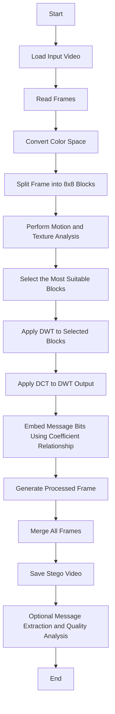
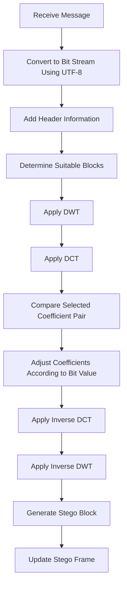
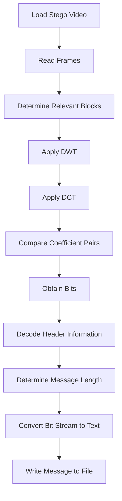

# Adaptive DWT-DCT Video Steganography

This project is a **DWT-DCT-based video steganography system with adaptive block selection**, designed to **embed hidden text data** into digital video and **extract it when needed**.

The system analyzes video frames to identify regions that are more suitable in terms of motion and texture, then embeds the message into those regions using **Discrete Wavelet Transform (DWT)** and **Discrete Cosine Transform (DCT)**. In this way, both **visual quality is preserved** and the **robustness of the embedded data is improved**.

This README is prepared to be placed directly in the root directory of the project folder.

---

## Table of Contents

- [1. Project Overview](#1-project-overview)
- [2. Project Objective](#2-project-objective)
- [3. Core Approach](#3-core-approach)
- [4. System Flows](#4-system-flows)
- [5. Key Features](#5-key-features)
- [6. Technologies Used](#6-technologies-used)
- [7. Requirements](#7-requirements)
- [8. Project Folder Structure](#8-project-folder-structure)
- [9. Installation](#9-installation)
- [10. Configuration File (`config.yaml`)](#10-configuration-file-configyaml)
- [11. Expected Workflow](#11-expected-workflow)
- [12. Outputs](#12-outputs)
- [13. Evaluation and Quality Analysis](#13-evaluation-and-quality-analysis)
- [14. Technical Notes](#14-technical-notes)
- [15. Limitations](#15-limitations)
- [16. Development Suggestions](#16-development-suggestions)
- [17. License](#17-license)

---

## 1. Project Overview

Video steganography is an information hiding approach that aims to place a message inside video data in a way that is **difficult for the human eye to detect**.

Instead of treating all frames and all regions equally, the method proposed in this project first performs analysis and then selects more suitable areas for embedding. This provides a more controlled, balanced, and experimentally adjustable structure.

According to the defined workflow, the system:

- Reads the input video.
- Processes frames step by step.
- Selects suitable blocks based on motion and texture.
- Applies DWT and DCT to the selected blocks.
- Embeds message bits using specific coefficient pairs.
- Produces the stego video.
- Extracts the hidden message when required.
- Performs visual quality and similarity evaluation.

---

## 2. Project Objective

The main objective of this project is to embed text-based hidden messages into digital video while achieving the following goals:

- Store the message inside the video with low detectability.
- Adaptively select more suitable regions for embedding.
- Build a more controlled embedding mechanism in the frequency domain.
- Enable later extraction of the embedded message.
- Evaluate the visual quality of the generated stego video.
- Provide a flexible structure for experiments with different parameters.

---

## 3. Core Approach

This project follows a **transform-domain steganography approach** rather than directly modifying pixels in the spatial domain.

### General Steps of the Method

1. **Video Reading**  
   The input video is processed frame by frame.

2. **Color Space Conversion**  
   Frames are converted into the color space defined in the configuration. In the current setup, this is specified as `ycrcb`.

3. **Block Partitioning**  
   Frames are divided into blocks of fixed size. In the current configuration, the block size is `8x8`.

4. **Adaptive Block Selection**  
   Motion and texture information are evaluated together. The most suitable blocks are scored and selected.

5. **DWT Application**  
   DWT is applied to the selected blocks according to the specified wavelet type and level.

6. **DCT Application**  
   After DWT, DCT is applied to the appropriate components.

7. **Bit Embedding**  
   Message bits are embedded by using the relationship between two selected DCT coefficients.

8. **Header Information Usage**  
   Header bits are added for message length or control purposes.

9. **Stego Video Generation**  
   The processed frames are recombined to form the stego video.

10. **Message Extraction and Evaluation**  
    If needed, the message is extracted and quality measurements are reported.

---

## 4. System Flows

The following flowcharts are included in **Mermaid** syntax so they can be rendered directly inside the README.

### 4.1 General System Flow



### 4.2 Message Embedding Flow



### 4.3 Message Extraction Flow



---

## 5. Key Features

- Video steganography approach based on adaptive block selection
- Hybrid DWT + DCT transform-based method
- Motion- and texture-based region analysis
- Support for text message embedding and extraction
- Header bits for message length or control information
- Parameter management through `config.yaml`
- Stego video generation
- Preview video generation support
- Writing the extracted message to a text file
- Creating an evaluation report in JSON format
- Optional SSIM computation support
- Process logs and development records

---

## 6. Technologies Used

### Programming Language

- **Python**

### Main Libraries

- **NumPy**
- **OpenCV**
- **PyWavelets**
- **SciPy**
- **scikit-image**
- **PyYAML**
- **pytest**

### Roles of the Libraries

- `numpy`  
  Used for numerical operations and matrix-based computations.

- `opencv-python`  
  Used for video reading, frame processing, color space conversion, and output video generation.

- `PyWavelets`  
  Used for discrete wavelet transform operations.

- `scipy`  
  Used for DCT and related scientific computations.

- `scikit-image`  
  Can be used especially for quality metrics such as SSIM.

- `PyYAML`  
  Provides configuration management by reading the `config.yaml` file.

- `pytest`  
  Can be used for unit testing and validation processes.

---

## 7. Requirements

The main dependencies used in the project are listed below:

```txt
numpy
opencv-python
PyWavelets
scipy
scikit-image
pytest
PyYAML
```

Recommended Python version:

```txt
Python 3.9+
```

---

## 8. Project Folder Structure

The following structure shows an example directory organization that can be placed directly in the project root folder:

```bash
.
├── config.yaml
├── requirements.txt
├── README.md
├── README_EN.md
├── data/
│   ├── input/
│   │   └── input_video.mp4
│   └── output/
│       ├── stego_video.avi
│       ├── stego_video_preview.mp4
│       ├── extracted_message.txt
│       └── evaluation_report.json
├── logs/
│   ├── process.log
│   └── development_steps.txt
└── src/
```

### Directory Descriptions

#### `config.yaml`
The main configuration file that contains all execution parameters.

#### `requirements.txt`
Lists the required Python dependencies.

#### `data/input/`
The input video is stored in this folder.

#### `data/output/`
Output files such as the stego video, preview video, extracted message, and evaluation report are stored in this folder.

#### `logs/`
Contains log files used for process records and development notes.

#### `src/`
The directory where the project source code exists or will exist.

> Note: If the full implementation code is not yet available, the `src/` folder can later be shaped according to the modules to be developed.

---

## 9. Installation

### 9.1 Clone or Prepare the Project Folder

If the project will be used as a Git repository:

```bash
git clone <repo-url>
cd <project-folder>
```

If you are creating the project manually, placing the files in the same folder structure is sufficient.

### 9.2 Create a Virtual Environment

#### Windows

```bash
python -m venv venv
venv\Scripts\activate
```

#### macOS / Linux

```bash
python3 -m venv venv
source venv/bin/activate
```

### 9.3 Install Dependencies

```bash
pip install -r requirements.txt
```

---

## 10. Configuration File (`config.yaml`)

The core behavior of the project is controlled through `config.yaml`.

Below is the organized representation of the current configuration:

```yaml
project:
  name: "Adaptive DWT-DCT Video Steganography"
  log_level: "INFO"

paths:
  input_video: "data/input/input_video.mp4"
  stego_video: "data/output/stego_video.avi"
  stego_preview_video: "data/output/stego_video_preview.mp4"
  extracted_text: "data/output/extracted_message.txt"
  report_json: "data/output/evaluation_report.json"
  process_log: "logs/process.log"
  development_log: "logs/development_steps.txt"

video:
  max_frames: null
  frame_step: 1
  color_space: "ycrcb"
  output_codec: "FFV1"

analysis:
  block_size: 8
  top_block_ratio: 0.2
  motion_weight: 0.6
  texture_weight: 0.4
  canny_low: 80
  canny_high: 160

transform:
  wavelet: "haar"
  dwt_level: 1
  dct_pair_indices: [2, 5]
  coefficient_margin: 35.0

payload:
  header_bits: 32
  text_encoding: "utf-8"

evaluation:
  compute_ssim: true
```

### Section-by-Section Explanation

#### `project`
Defines the project name and log level.

- `name`: Project name
- `log_level`: Logging level

#### `paths`
Defines the input and output file paths.

- `input_video`: Input video to be processed
- `stego_video`: Generated stego video
- `stego_preview_video`: Preview video
- `extracted_text`: Extracted hidden message file
- `report_json`: Evaluation report
- `process_log`: Application process logs
- `development_log`: Development notes

#### `video`
Controls video processing behavior.

- `max_frames`: Maximum number of frames to be processed
- `frame_step`: Specifies how often frames will be processed
- `color_space`: Color space to be used
- `output_codec`: Output video codec

#### `analysis`
Contains block analysis and adaptive selection parameters.

- `block_size`: Block size used to divide frames
- `top_block_ratio`: Ratio of the most suitable blocks to use
- `motion_weight`: Weight of the motion score
- `texture_weight`: Weight of the texture score
- `canny_low`: Lower Canny threshold value
- `canny_high`: Upper Canny threshold value

#### `transform`
Contains transform-based embedding parameters.

- `wavelet`: Wavelet type to be used
- `dwt_level`: DWT level
- `dct_pair_indices`: DCT coefficient indices to compare
- `coefficient_margin`: Safety margin for coefficient difference

#### `payload`
Contains fields related to message structure.

- `header_bits`: Number of bits reserved for the message header
- `text_encoding`: Character encoding to be used

#### `evaluation`
Defines quality evaluation options.

- `compute_ssim`: Determines whether SSIM computation is enabled

---

## 11. Expected Workflow

Even if the source code is not yet complete, the expected system workflow according to the configuration is as follows:

1. The `config.yaml` file is read.
2. The video defined under `paths.input_video` is loaded.
3. The video is processed frame by frame.
4. Each frame is converted into the specified color space.
5. Frames are divided into blocks according to the `block_size` value.
6. The most suitable blocks are selected using motion and texture analysis.
7. DWT and then DCT are applied to the selected blocks.
8. The hidden message is embedded through DCT coefficient relationships together with the `header_bits` structure.
9. New frames are merged to create `stego_video`.
10. If needed, `stego_preview_video` is generated.
11. Through the extraction process, the content is read back and written to the `extracted_text` file.
12. Evaluation results are saved into `report_json`.
13. The process is written to log files.

---

## 12. Outputs

According to the current configuration, the project is expected to generate the following output files:

### 12.1 Stego Video

```txt
data/output/stego_video.avi
```

This is the main output video containing the hidden message.

### 12.2 Preview Video

```txt
data/output/stego_video_preview.mp4
```

This is a preview version that may be generated for easier playback or sharing.

### 12.3 Extracted Message

```txt
data/output/extracted_message.txt
```

The message extracted back from the stego video is stored in this file.

### 12.4 Evaluation Report

```txt
data/output/evaluation_report.json
```

This is the report file where quality and performance metrics are stored in JSON format.

### 12.5 Process Logs

```txt
logs/process.log
logs/development_steps.txt
```

These files can be used for application flow tracking, debugging, and development notes.

---

## 13. Evaluation and Quality Analysis

In steganography systems, not only embedding the message but also preserving the quality of the output video is critically important.

At minimum, the following evaluation steps are expected in this project:

- Examining the visual difference between the original video and the stego video
- Checking whether the message can be extracted successfully
- Performing structural similarity analysis using SSIM
- Storing the results as a JSON report

The value `evaluation.compute_ssim: true` indicates that SSIM computation is enabled.

### Additional Metrics That Can Be Added Later

- PSNR
- MSE
- Bit Error Rate (BER)
- Payload Capacity
- Robustness Tests

---

## 14. Technical Notes

### Why DWT-DCT?

When DWT and DCT are used together, it becomes possible to perform more controlled operations in the frequency domain and to develop embedding strategies that are less noticeable.

- **DWT** separates the signal into different frequency bands and provides multi-resolution analysis.
- **DCT** allows energy to be concentrated in specific coefficients.
- Using both methods together can provide a better balance between imperceptibility and robustness.

### Why Adaptive Block Selection?

Not every video frame and every region is equally suitable for message embedding. Areas that are rich in motion or texture can mask embedding traces more effectively.

For this reason, the system:

- Does not evaluate all blocks equally.
- Selects more suitable blocks.
- Applies a more controlled embedding strategy.

### What Is the Purpose of the Coefficient Margin?

The parameter `coefficient_margin: 35.0` is intended to preserve the difference between two DCT coefficients with a certain safety margin.

This approach can:

- Make bit decisions more stable,
- Reduce uncertainty during extraction,
- Contribute to a more robust embedding process.

---

## 15. Limitations

This README has been prepared according to the current configuration and dependency information. Since the source code has not yet been fully provided, the following limitations apply:

- The actual input file name and command-line interface are not yet fully defined.
- Message embedding capacity, error handling, and complete algorithmic details cannot be verified without the code.
- The actual channel or band selection will become clear according to the implementation.
- Definite statements about performance, speed, and memory usage cannot be made without the code.

Therefore, this README should be considered a professional foundational document describing the project architecture.

---

## 16. Development Suggestions

To make the project stronger and more presentable, the following improvements can be added:

- Developing a command-line interface (CLI)
- Designing separate modules for message embedding and extraction
- Adding PSNR, MSE, and BER calculations
- Comparing different wavelet types
- Running experiments on different DCT coefficient pairs
- Adding robustness tests
- Supporting binary data embedding in addition to text
- Building a hybrid security approach with encryption
- Adding automatic experiment report generation
- Expanding unit test coverage

---

## 17. License

License information has not yet been specified for this project.

If a license will be added, this section can be updated with one of the following:

- MIT License
- Apache 2.0
- GNU GPL v3
- Institutional / Academic Use License

---

## Final Note

This file has been prepared to be placed in the root directory of the project folder. The file name can be used directly as follows:

```txt
README_EN.md
```
# Video_Steganography

