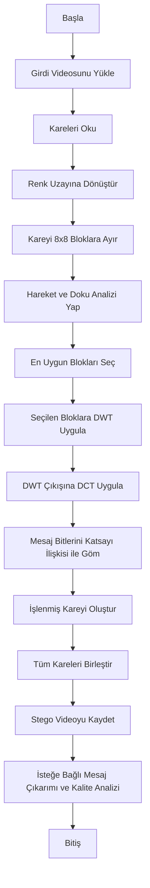
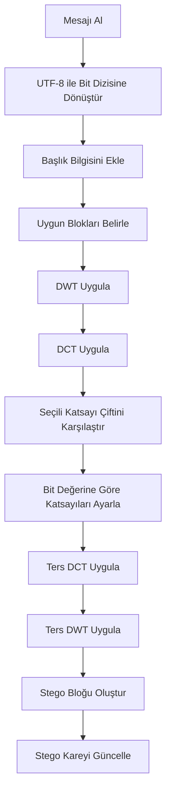
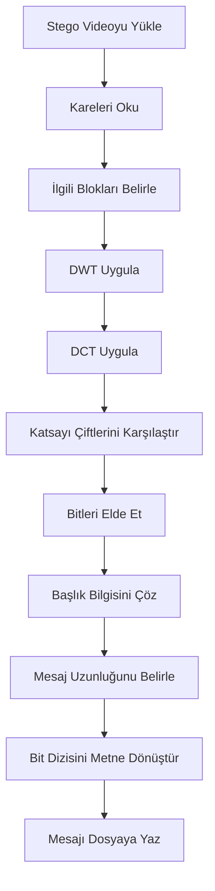

# Adaptive DWT-DCT Video Steganography

Bu proje, dijital video ortamında **gizli metin verisinin gömülmesi** ve gerektiğinde **geri çıkarılması** amacıyla tasarlanmış, **uyarlanabilir blok seçimine dayalı DWT-DCT tabanlı bir video steganografi sistemi**dir.

Sistem; video karelerini analiz ederek hareket ve doku bakımından daha uygun bölgeleri seçmeyi, ardından bu bölgelerde **Ayrık Dalgacık Dönüşümü (DWT)** ve **Ayrık Kosinüs Dönüşümü (DCT)** kullanarak mesaj gömmeyi hedefler. Böylece hem **görsel kalite korunur** hem de **gömülü verinin dayanıklılığı artırılır**.

Bu README, proje klasörünün kök dizinine doğrudan yerleştirilecek şekilde hazırlanmıştır.

---

## İçindekiler

- [1. Proje Özeti](#1-proje-özeti)
- [2. Projenin Amacı](#2-projenin-amacı)
- [3. Temel Yaklaşım](#3-temel-yaklaşım)
- [4. Sistem Akışları](#4-sistem-akışları)
- [5. Temel Özellikler](#5-temel-özellikler)
- [6. Kullanılan Teknolojiler](#6-kullanılan-teknolojiler)
- [7. Gereksinimler](#7-gereksinimler)
- [8. Proje Klasör Yapısı](#8-proje-klasör-yapısı)
- [9. Kurulum](#9-kurulum)
- [10. Yapılandırma Dosyası (`config.yaml`)](#10-yapılandırma-dosyası-configyaml)
- [11. Beklenen Çalışma Mantığı](#11-beklenen-çalışma-mantığı)
- [12. Çıktılar](#12-çıktılar)
- [13. Değerlendirme ve Kalite Analizi](#13-değerlendirme-ve-kalite-analizi)
- [14. Teknik Notlar](#14-teknik-notlar)
- [15. Sınırlamalar](#15-sınırlamalar)
- [16. Geliştirme Önerileri](#16-geliştirme-önerileri)
- [17. Lisans](#17-lisans)

---

## 1. Proje Özeti

Video steganografi, bir mesajın video verisi içine **insan gözüyle fark edilmesi zor olacak şekilde** yerleştirilmesini amaçlayan bilgi gizleme yaklaşımıdır.

Bu projede önerilen yöntem, tüm kareleri ve tüm bölgeleri eşit biçimde kullanmak yerine önce analiz yapar, ardından gömme için daha uygun alanları seçer. Böylece daha kontrollü, daha dengeli ve deneysel olarak ayarlanabilir bir yapı elde edilir.

Projede tanımlanan akışa göre sistem:

- Girdi videosunu okur.
- Kareleri belirli adımlarla işler.
- Hareket ve doku temelli uygun blokları seçer.
- Seçilen bloklarda DWT ve DCT uygular.
- Belirli katsayı çiftleri üzerinden mesaj bitlerini gömer.
- Stego videoyu üretir.
- Gerekirse gömülü mesajı tekrar çıkarır.
- Görsel kalite ve benzerlik değerlendirmesi yapar.

---

## 2. Projenin Amacı

Bu projenin temel amacı, dijital video içine metin tabanlı gizli mesaj gömme sürecini aşağıdaki hedeflerle gerçekleştirmektir:

- Mesajı video içinde düşük fark edilebilirlikle saklamak
- Gömme için daha uygun bölgeleri adaptif olarak seçmek
- Frekans uzayında çalışarak daha kontrollü bir gömme mekanizması kurmak
- Gömülü mesajın daha sonra geri çıkarılmasını sağlamak
- Üretilen stego videonun görsel kalitesini değerlendirmek
- Farklı parametrelerle deney yapılabilecek esnek bir yapı sunmak

---

## 3. Temel Yaklaşım

Bu proje, uzamsal alanda doğrudan piksel değiştirmek yerine **dönüşüm tabanlı bir steganografi yaklaşımı** izler.

### Yöntemin Genel Adımları

1. **Video Okuma**  
   Girdi videosu kare kare işlenir.

2. **Renk Uzayı Dönüşümü**  
   Kareler yapılandırmada belirtilen renk uzayına dönüştürülür. Mevcut ayarda bu alan `ycrcb` olarak tanımlanmıştır.

3. **Bloklara Ayırma**  
   Kareler belirli boyutlarda bloklara ayrılır. Mevcut yapılandırmada blok boyutu `8x8` olarak belirlenmiştir.

4. **Uyarlanabilir Blok Seçimi**  
   Hareket ve doku bilgileri birlikte değerlendirilir. Daha uygun bloklar puanlanarak seçilir.

5. **DWT Uygulaması**  
   Seçilen bloklara belirlenen dalgacık türü ve seviyesine göre DWT uygulanır.

6. **DCT Uygulaması**  
   DWT sonrası uygun bileşenler üzerinde DCT uygulanır.

7. **Bit Gömme İşlemi**  
   Mesaj bitleri, belirlenen iki DCT katsayısı arasındaki ilişki kullanılarak gömülür.

8. **Başlık Bilgisi Kullanımı**  
   Mesaj uzunluğu veya kontrol amacıyla başlık bitleri eklenir.

9. **Stego Video Üretimi**  
   İşlenmiş kareler tekrar birleştirilerek stego video oluşturulur.

10. **Mesaj Çıkarma ve Değerlendirme**  
    Gerekirse mesaj geri çıkarılır ve kalite ölçümleri raporlanır.

---

## 4. Sistem Akışları

Aşağıdaki akış şemaları README içinde doğrudan görüntülenebilecek şekilde **Mermaid** sözdizimi ile eklenmiştir.


### 4.1 Genel Sistem Akışı



### 4.2 Mesaj Gömme Akışı



### 4.3 Mesaj Çıkarma Akışı



---

## 5. Temel Özellikler

- Uyarlanabilir blok seçimine dayalı video steganografi yaklaşımı
- DWT + DCT tabanlı hibrit dönüşüm yöntemi
- Hareket ve doku temelli bölge analizi
- Metin mesajı gömme ve geri çıkarma desteği
- Başlık bitleri ile mesaj uzunluğu veya kontrol bilgisi taşıma
- `config.yaml` üzerinden parametre yönetimi
- Stego video üretimi
- Önizleme videosu üretme desteği
- Çıkarılan mesajı metin dosyasına yazma
- JSON formatında değerlendirme raporu oluşturma
- İsteğe bağlı SSIM hesaplama desteği
- Süreç logları ve geliştirme kayıtları tutabilme

---

## 6. Kullanılan Teknolojiler

### Programlama Dili

- **Python**

### Temel Kütüphaneler

- **NumPy**
- **OpenCV**
- **PyWavelets**
- **SciPy**
- **scikit-image**
- **PyYAML**
- **pytest**

### Kütüphanelerin Rolleri

- `numpy`  
  Sayısal işlemler ve matris tabanlı hesaplamalar için kullanılır.

- `opencv-python`  
  Video okuma, kare işleme, renk uzayı dönüşümleri ve çıktı videosu üretimi için kullanılır.

- `PyWavelets`  
  Ayrık dalgacık dönüşümü işlemleri için kullanılır.

- `scipy`  
  DCT ve ilgili bilimsel hesaplamalar için kullanılır.

- `scikit-image`  
  Özellikle SSIM gibi kalite metriklerinin hesaplanmasında kullanılabilir.

- `PyYAML`  
  `config.yaml` dosyasını okuyarak yapılandırma yönetimini sağlar.

- `pytest`  
  Birim testleri ve doğrulama süreçleri için kullanılabilir.

---

## 7. Gereksinimler

Projede kullanılan temel bağımlılıklar aşağıdaki gibidir:

```txt
numpy
opencv-python
PyWavelets
scipy
scikit-image
pytest
PyYAML
```

Önerilen Python sürümü:

```txt
Python 3.9+
```

---

## 8. Proje Klasör Yapısı

Aşağıdaki yapı, projenin kök klasörüne doğrudan yerleştirilebilecek örnek dizin organizasyonunu göstermektedir:

```bash
.
├── config.yaml
├── requirements.txt
├── README.md
├── README_EN.md
├── data/
│   ├── input/
│   │   └── input_video.mp4
│   └── output/
│       ├── stego_video.avi
│       ├── stego_video_preview.mp4
│       ├── extracted_message.txt
│       └── evaluation_report.json
├── logs/
│   ├── process.log
│   └── development_steps.txt
└── src/
```

### Dizin Açıklamaları

#### `config.yaml`
Tüm çalışma parametrelerini içeren ana yapılandırma dosyasıdır.

#### `requirements.txt`
Gerekli Python bağımlılıklarını listeler.

#### `data/input/`
Girdi videosu bu klasörde tutulur.

#### `data/output/`
Stego video, önizleme videosu, çıkarılan mesaj ve değerlendirme raporu gibi çıktı dosyaları bu klasörde saklanır.

#### `logs/`
Süreç kayıtları ve geliştirme notları için kullanılan log dosyalarını içerir.

#### `src/`
Proje kaynak kodlarının bulunduğu veya bulunacağı dizindir.

> Not: Elinizde henüz tam uygulama kodu yoksa `src/` klasörü ileride geliştirilecek modüllere göre şekillendirilebilir.

---

## 9. Kurulum

### 9.1 Projeyi Klasöre Alın

Eğer proje bir Git deposu olarak kullanılacaksa:

```bash
git clone <repo-url>
cd <project-folder>
```

Eğer projeyi manuel oluşturuyorsanız, dosyaları aynı klasör yapısında yerleştirmeniz yeterlidir.

### 9.2 Sanal Ortam Oluşturun

#### Windows

```bash
python -m venv venv
venv\Scripts\activate
```

#### macOS / Linux

```bash
python3 -m venv venv
source venv/bin/activate
```

### 9.3 Bağımlılıkları Yükleyin

```bash
pip install -r requirements.txt
```

---

## 10. Yapılandırma Dosyası (`config.yaml`)

Projede temel davranışlar `config.yaml` üzerinden kontrol edilir.

Aşağıda mevcut yapılandırmanın düzenli gösterimi yer almaktadır:

```yaml
project:
  name: "Adaptive DWT-DCT Video Steganography"
  log_level: "INFO"

paths:
  input_video: "data/input/input_video.mp4"
  stego_video: "data/output/stego_video.avi"
  stego_preview_video: "data/output/stego_video_preview.mp4"
  extracted_text: "data/output/extracted_message.txt"
  report_json: "data/output/evaluation_report.json"
  process_log: "logs/process.log"
  development_log: "logs/development_steps.txt"

video:
  max_frames: null
  frame_step: 1
  color_space: "ycrcb"
  output_codec: "FFV1"

analysis:
  block_size: 8
  top_block_ratio: 0.2
  motion_weight: 0.6
  texture_weight: 0.4
  canny_low: 80
  canny_high: 160

transform:
  wavelet: "haar"
  dwt_level: 1
  dct_pair_indices: [2, 5]
  coefficient_margin: 35.0

payload:
  header_bits: 32
  text_encoding: "utf-8"

evaluation:
  compute_ssim: true
```

### Bölüm Bazlı Açıklama

#### `project`
Projenin adı ve log seviyesini belirler.

- `name`: Proje adı
- `log_level`: Loglama seviyesi

#### `paths`
Girdi ve çıktı dosyalarının yollarını tanımlar.

- `input_video`: İşlenecek giriş videosu
- `stego_video`: Üretilecek stego video
- `stego_preview_video`: Önizleme videosu
- `extracted_text`: Çıkarılan gizli mesaj dosyası
- `report_json`: Değerlendirme raporu
- `process_log`: Uygulama süreç logları
- `development_log`: Geliştirme notları

#### `video`
Video işleme davranışını kontrol eder.

- `max_frames`: İşlenecek maksimum kare sayısı
- `frame_step`: Her kaç karede bir işleme yapılacağını belirler
- `color_space`: Kullanılacak renk uzayı
- `output_codec`: Çıktı video codec'i

#### `analysis`
Blok analizi ve uyarlanabilir seçim parametrelerini içerir.

- `block_size`: Karelerin bölüneceği blok boyutu
- `top_block_ratio`: En uygun blokların kullanılma oranı
- `motion_weight`: Hareket skorunun ağırlığı
- `texture_weight`: Doku skorunun ağırlığı
- `canny_low`: Canny alt eşik değeri
- `canny_high`: Canny üst eşik değeri

#### `transform`
Dönüşüm tabanlı gömme parametrelerini içerir.

- `wavelet`: Kullanılacak dalgacık türü
- `dwt_level`: DWT seviyesi
- `dct_pair_indices`: Karşılaştırılacak DCT katsayı indisleri
- `coefficient_margin`: Katsayı farkı için güvenlik marjı

#### `payload`
Mesaj yapısına ilişkin alanları içerir.

- `header_bits`: Mesaj başlığı için ayrılan bit sayısı
- `text_encoding`: Kullanılacak karakter kodlaması

#### `evaluation`
Kalite değerlendirme seçeneklerini belirler.

- `compute_ssim`: SSIM hesaplamasının yapılıp yapılmayacağını belirler

---

## 11. Beklenen Çalışma Mantığı

Kaynak kod henüz tamamlanmamış olsa bile yapılandırmaya göre sistemin beklenen çalışma mantığı aşağıdaki gibidir:

1. `config.yaml` dosyası okunur.
2. `paths.input_video` altında tanımlanan video yüklenir.
3. Video karelere ayrılarak işlenir.
4. Her kare, belirtilen renk uzayına dönüştürülür.
5. Kareler `block_size` değerine göre bloklara ayrılır.
6. Hareket ve doku analizi ile en uygun bloklar seçilir.
7. Seçilen bloklara DWT ve ardından DCT uygulanır.
8. Gizli mesaj, `header_bits` yapısı ile birlikte DCT katsayı ilişkileri üzerinden gömülür.
9. Yeni kareler birleştirilerek `stego_video` oluşturulur.
10. Gerekirse `stego_preview_video` üretilir.
11. Mesaj çıkarma işlemi ile içerik geri okunur ve `extracted_text` dosyasına yazılır.
12. Değerlendirme sonuçları `report_json` içine kaydedilir.
13. İşlem süreci log dosyalarına yazılır.

---

## 12. Çıktılar

Mevcut yapılandırmaya göre proje aşağıdaki çıktı dosyalarını üretmeyi hedeflemektedir:

### 12.1 Stego Video

```txt
data/output/stego_video.avi
```

Gizli mesaj gömülmüş ana çıktı videosudur.

### 12.2 Önizleme Videosu

```txt
data/output/stego_video_preview.mp4
```

Daha kolay oynatma veya paylaşım için üretilebilecek önizleme sürümüdür.

### 12.3 Çıkarılan Mesaj

```txt
data/output/extracted_message.txt
```

Stego videodan geri çıkarılan mesaj bu dosyada tutulur.

### 12.4 Değerlendirme Raporu

```txt
data/output/evaluation_report.json
```

Kalite ve performans metriklerinin JSON formatında tutulduğu rapor dosyasıdır.

### 12.5 Süreç Logları

```txt
logs/process.log
logs/development_steps.txt
```

Uygulama akışı, hata ayıklama ve geliştirme notları için kullanılabilir.

---

## 13. Değerlendirme ve Kalite Analizi

Steganografi sistemlerinde yalnızca mesajın gömülmesi değil, aynı zamanda çıktı videonun kalite düzeyi de kritik öneme sahiptir.

Bu projede en azından aşağıdaki değerlendirme adımları öngörülmektedir:

- Orijinal video ile stego video arasındaki görsel farkın incelenmesi
- Mesajın başarıyla geri çıkarılıp çıkarılamadığının kontrol edilmesi
- SSIM ile yapısal benzerlik analizi yapılması
- Sonuçların JSON raporu olarak saklanması

`evaluation.compute_ssim: true` değeri, SSIM hesaplamasının etkin olduğunu göstermektedir.

### İleride Eklenebilecek Ek Metrikler

- PSNR
- MSE
- Bit Error Rate (BER)
- Payload Capacity
- Robustness Testleri

---

## 14. Teknik Notlar

### Neden DWT-DCT?

DWT ve DCT birlikte kullanıldığında hem frekans alanında daha kontrollü işlem yapmak hem de daha az fark edilir gömme stratejileri geliştirmek mümkün olabilir.

- **DWT**, sinyali farklı frekans bantlarına ayırarak çok çözünürlüklü analiz sağlar.
- **DCT**, enerjinin belirli katsayılarda toplanmasına imkân verir.
- İki yöntemin birlikte kullanılması, görünmezlik ve dayanıklılık arasında daha dengeli bir yaklaşım sağlayabilir.

### Neden Uyarlanabilir Blok Seçimi?

Her video karesi ve her bölge, mesaj gömme için aynı derecede uygun değildir. Hareketli veya dokusal açıdan zengin alanlar, gömme izlerini daha iyi maskeleyebilir.

Bu nedenle sistem:

- Tüm blokları eşit değerlendirmez.
- Daha uygun blokları seçer.
- Daha kontrollü bir gömme stratejisi uygular.

### Katsayı Marjı Ne İşe Yarar?

`coefficient_margin: 35.0` parametresi, iki DCT katsayısı arasındaki farkın belirli bir güvenlik payı ile korunmasını amaçlar.

Bu yaklaşım:

- Bit kararlarını daha kararlı hâle getirebilir.
- Çıkarım sırasında belirsizliği azaltabilir.
- Gömme işleminin daha sağlam uygulanmasına katkı sağlayabilir.

---

## 15. Sınırlamalar

Bu README, mevcut yapılandırma ve bağımlılık bilgilerine göre hazırlanmıştır. Kaynak kod henüz tam olarak verilmediği için aşağıdaki sınırlamalar geçerlidir:

- Gerçek giriş dosyası adı ve komut satırı arayüzü henüz net değildir.
- Mesaj gömme kapasitesi, hata yönetimi ve tam algoritmik ayrıntılar kod olmadan doğrulanamaz.
- Kullanılan kanal veya bant seçimi uygulama koduna göre netleşecektir.
- Performans, hız ve bellek tüketimi hakkında kesin ifadeler kod olmadan verilemez.

Bu nedenle bu README, proje mimarisini profesyonel şekilde tanımlayan bir temel belge olarak değerlendirilmelidir.

---

## 16. Geliştirme Önerileri

Projeyi daha güçlü ve sunulabilir hâle getirmek için aşağıdaki geliştirmeler eklenebilir:

- Komut satırı arayüzü (CLI) geliştirilmesi
- Mesaj gömme ve çıkarma için ayrı modüller tasarlanması
- PSNR, MSE ve BER hesaplamalarının eklenmesi
- Farklı wavelet türlerinin karşılaştırılması
- Farklı DCT katsayı çiftleri üzerinde deney yapılması
- Dayanıklılık testlerinin eklenmesi
- Metin dışında ikili veri gömme desteği verilmesi
- Şifreleme ile hibrit güvenlik yaklaşımı kurulması
- Otomatik deney raporu üretiminin eklenmesi
- Birim test kapsamının genişletilmesi

---

## 17. Lisans

Bu proje için lisans bilgisi henüz belirtilmemiştir.

Lisans eklenecekse bu bölüm aşağıdaki yapılardan biriyle güncellenebilir:

- MIT License
- Apache 2.0
- GNU GPL v3
- Kurumsal / Akademik Kullanım Lisansı

---

## Son Not

Bu dosya, proje klasörünün kök dizinine koyulacak şekilde hazırlanmıştır. Dosya adı doğrudan şu şekilde kullanılabilir:

```txt
README.md
```

